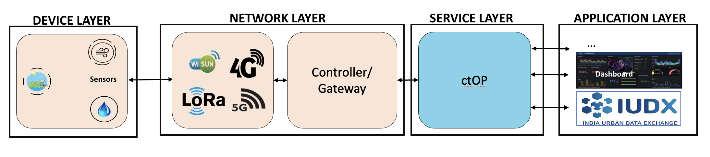
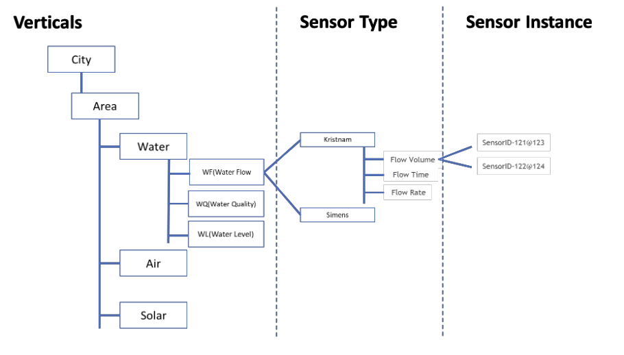

# High-Level Architecture
ctOP occupies a crucial position within the Service Layer of a four-layered smart city architecture, encompassing Device, Network, Service, and Application layers. This strategic placement allows ctOP to act as a central middleware component, bridging the gap between the Network and Application layers. Let's explore the key aspects of this architecture:

## ctOP within the Smart City Ecosystem:
- Four-Layered Architecture: ctOP resides within the Service Layer, interacting with the Network Layer below (handling low-level communication) and the Application Layer above (providing services to applications).
- Middleware Functionality: ctOP acts as a middleware, translating between the oneM2M standard used in the Network Layer and the needs of applications in the Application Layer.

## Hierarchical Data Model:
- Domains: The data model is organized into Domains, representing distinct areas of application within the smart city (e.g., transportation, environment, energy).
- Sensor Types: Within each Domain, Sensor Types define the variety of sensors based on their Key Performance Indicators (KPIs) or parameters they measure.
- Nodes: Individual instances of Sensor Types are represented as Nodes, corresponding to physical IoT devices in the real world.

