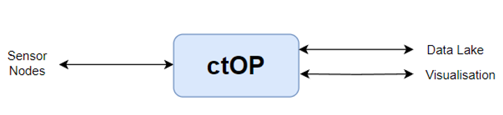

import { Card, CardContainer } from '@site/src/components/Card';

# Introduction
The City IoT Operating Platform is a lightweight oneM2M wrapper internally named ctOP designed to enhance interoperability and simplify IoT device integration for smart city deployments. Its aim is to facilitate the creation of smarter, more efficient cities by streamlining the IoT ecosystem. This document is intended for IoT developers, city planners, and those interested in smart city technology.

ctOP serves as an intermediary system providing user authentication and access control for oneM2M-based IoT ecosystems. It offers an intuitive interface for users to manage their IoT devices and network security. ctOP includes the following features that would be incorporated in Phase I. Once deployed, the features can be added, and the module optimized as per the requirements. This ctOP platform may serve as the underlying sensory data layer in any city that can be part of the smart Cities Mission’s City Operations Platform (COP).

# Overview

This guide is designed to help you understand and navigate the documentation effectively. Here you will find information on how to get started, install, and use ctOP in your projects.

Get started by exploring the key areas of our documentation to help you get up to speed with what ctOP has to offer.

<CardContainer>
  <Card
    title="Introduction"
    description="Learn more about ctOP and the Smart City Living Lab at IIITH."
    link="/introduction/about-ctop"
    linkText="Explore Introduction"
  />

  <Card
    title="Architecture"
    description="Understand the high-level architecture and components that make up ctOP."
    link="architecture/high-level-architecture"
    linkText="View Architecture"
  />

  <Card
    title="Installation Guide"
    description="Step-by-step instructions to install and configure ctOP."
    link="installation-deployment"
    linkText="Start Installation"
  />

  <Card
    title="API Documentation"
    description="Dive into our API endpoints and learn how to integrate with ctOP."
    link="api-documentation/api-overview"
    linkText="Check API Docs"
  />

  <Card
    title="Development Guide"
    description="Guidelines for setting up your development environment and contributing."
    link="development-guide/setup-development-environment"
    linkText="Develop with Us"
  />

  <Card
    title="FAQs"
    description="Find answers to frequently asked questions about using ctOP."
    link="faqs/general-faqs"
    linkText="Read FAQs"
  />
</CardContainer>
